# 🎓 National Education Policy (NEP) 2020 Survey Platform

[](https://reactjs.org/)
[](https://vitejs.dev/)
[](https://tailwindcss.com/)
[](https://firebase.google.com/)

A premium, fully interactive **Multi-Step Survey Platform** designed to collect, store, and analyze feedback regarding the implementation of the **National Education Policy (NEP) 2020**. Powered by a React frontend and Firebase Firestore, the application provides an immersive user experience, real-time analytics, and secure data pipelines.

---

## ✨ Key Features

- **🎯 Interactive Multi-Step Form**: A beautifully polished 15-step responsive wizard that guides respondents through demographic, academic, and policy-specific questions with absolute ease.
- **⚡ Conditional Form Paths**: Uses smart routing to serve customized questions based on user roles (e.g., current 3rd-year students receive distinct questions compared to pre-NEP alumni).
- **📊 Real-Time Analytics Dashboard**: Once submitted, users are instantly redirected to a sleek stats dashboard rendering comparative visual percentage bars for each survey question.
- **🎨 Glassmorphic Modern UI**: Implements custom background glow elements, smooth micro-interactions, responsive flex-grid layouts, and elegant form controls.
- **🔌 CSV Data Exporter**: Includes a automated Node.js export script (`exportFirestoreToCSV.js`) to securely extract Firestore collections into structured CSV sheets for machine learning or statistical analysis.

---

## 📸 Visual Walkthrough

Here is a step-by-step preview of the interactive survey flow, showcasing the responsive glassmorphic interfaces and the dynamic, real-time analytics dashboard:

### 🏁 1. Welcome & Onboarding
| Welcome Landing Page | Onboarding Details |
| --- | --- |
| 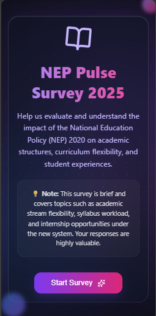 | 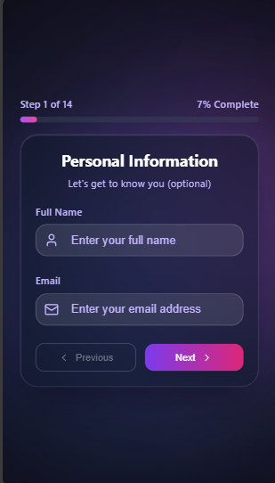 |

### 🧭 2. Smart Conditional Survey Flow
| Stream Selection | Status Selection | Awareness Evaluation |
| --- | --- | --- |
| 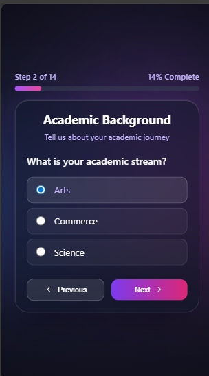 | 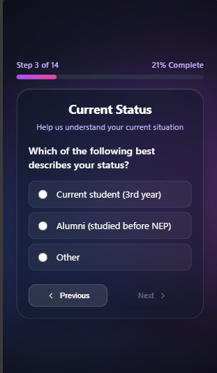 | 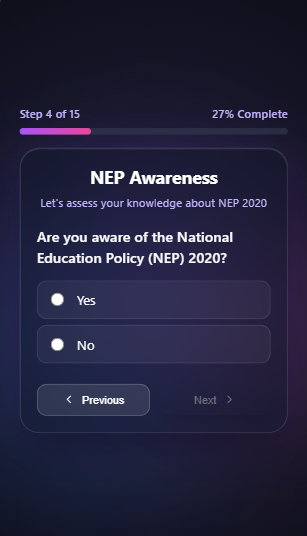 |

### 📝 3. Core Survey Questions (Compact & Focused)
| Question Sample 6 | Question Sample 7 | Question Sample 8 |
| --- | --- | --- |
| 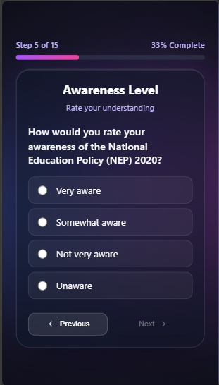 | 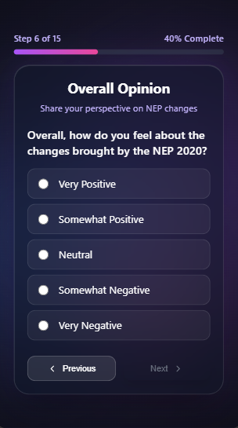 | 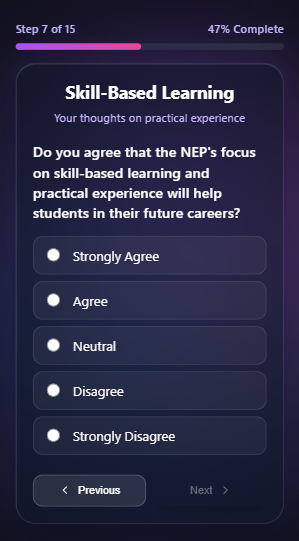 |

| Question Sample 9 | Question Sample 10 | Question Sample 11 |
| --- | --- | --- |
| 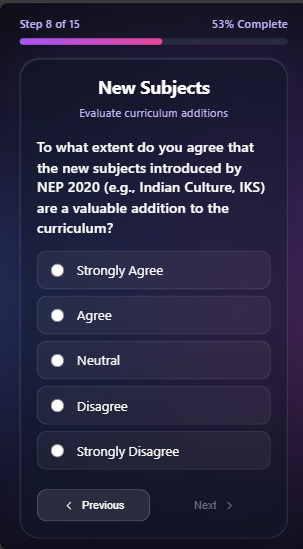 | 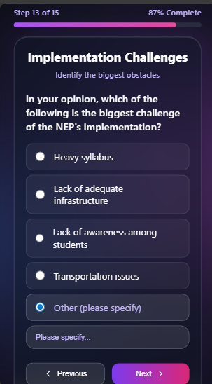 | 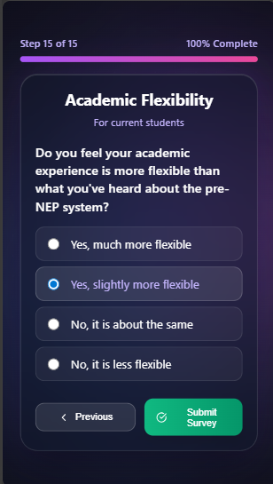 |

### 📊 4. Completion & Comparative Analytics Dashboard
Upon submitting, respondents are greeted with a success indicator, followed by a fully responsive analytics dashboard compiling comparative data in real-time:
| Submission Success | Result Dashboard Part 1 | Comprehensive Analytics Part 2 |
| --- | --- | --- |
| 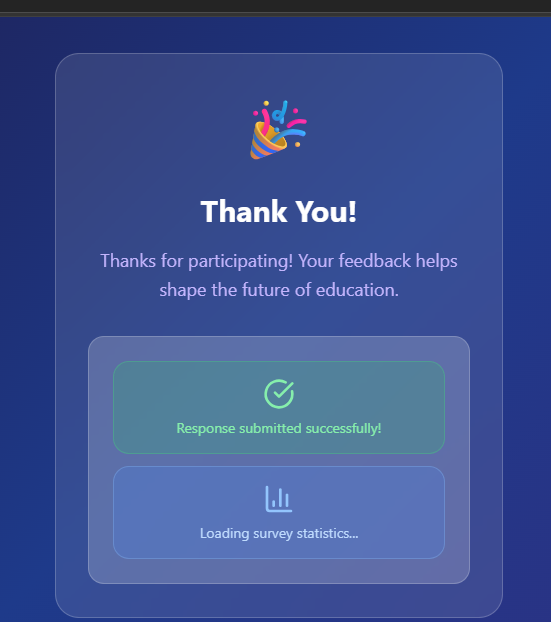 | 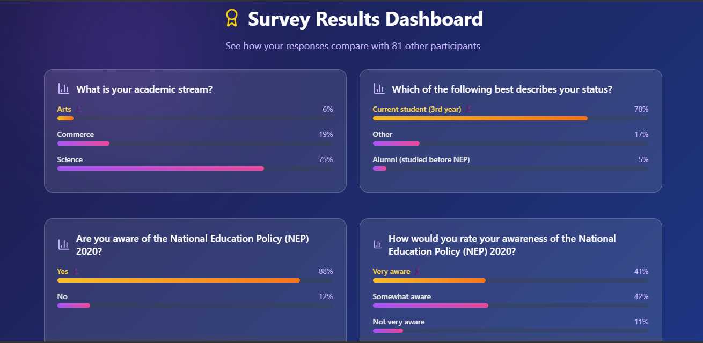 | 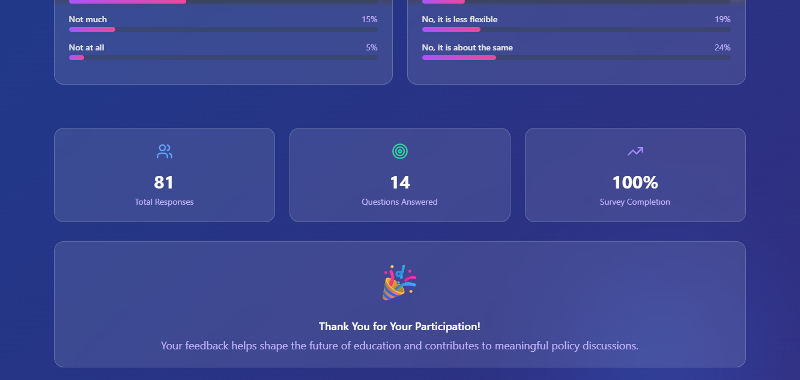 |

---

## 🛠️ Technology Stack

- **Frontend**: React (Functional Components, Hooks)
- **Build System**: Vite (Ultra-fast Hot Module Replacement)
- **Styling**: Tailwind CSS & Modern Custom Vanilla CSS (Fluid transitions, blur backdrops, glass cards)
- **Icons**: Lucide React
- **Backend & Database**: Firebase Firestore (NoSQL Document Store)
- **Hosting**: Firebase Hosting

---

## 🔒 Security & Best Practices (Important)

Before hosting this project publicly on GitHub, the following security configurations must be applied to protect user privacy and project database integrity.

> [!WARNING]
> **Survey Data Privacy (PII)**
> The raw survey submissions may collect personal identifiable information (emails and full names). Ensure that files like `survey_responses.csv` are **never committed to your public Git repository**. The project `.gitignore` has been pre-configured to block these.

> [!IMPORTANT]
> **Firestore Security Rules Configuration**
> Since Firebase client-side configuration parameters (API Keys) are public by design, you **must** configure robust rules in your Firebase Console to prevent malicious read/write requests.

Go to **Firebase Console** ➜ **Firestore Database** ➜ **Rules** and apply the following configuration:

```javascript
rules_version = '2';
service cloud.firestore {
  match /databases/{database}/documents {
    match /survey_responses/{document} {
      // Allow anyone to submit a response
      allow create: if true;
      
      // PREVENT PUBLIC READ: Only allow database reading in your private admin workspace,
      // or restrict reading to authenticated administrators.
      allow read: if false; 
      
      // Disable update and delete entirely for respondents
      allow update, delete: if false;
    }
  }
}
```

---

## 🚀 Getting Started

### 📋 Prerequisites

- **Node.js** (v16.x or higher)
- **npm** or **yarn**
- A **Firebase Project** configured in your Google/Firebase Console.

### 💻 Local Setup

1. **Clone the repository**:
   ```bash
   git clone https://github.com/your-username/nep-survey.git
   cd nep-survey
   ```

2. **Install dependencies**:
   ```bash
   npm install
   ```

3. **Configure Firebase**:
   Open [src/firebase.js](file:///e:/nep-survey/src/firebase.js) (and [exportFirestoreToCSV.js](file:///e:/nep-survey/exportFirestoreToCSV.js) if using the local exporter) and enter your web app configuration parameters:
   ```javascript
   const firebaseConfig = {
     apiKey: "YOUR_API_KEY",
     authDomain: "YOUR_PROJECT_ID.firebaseapp.com",
     projectId: "YOUR_PROJECT_ID",
     storageBucket: "YOUR_PROJECT_ID.firebasestorage.app",
     messagingSenderId: "YOUR_MESSAGING_SENDER_ID",
     appId: "YOUR_APP_ID"
   };
   ```

4. **Launch Local Development Server**:
   ```bash
   npm run dev
   ```
   Open `http://localhost:5173` in your browser to view the application.

---

## 📊 Data Export Pipeline

To pull submitted survey responses into a clean CSV format for data analysis or machine learning preparation:

1. Ensure the Firebase Configuration in `exportFirestoreToCSV.js` matches your project settings.
2. Run the export script locally:
   ```bash
   node exportFirestoreToCSV.js
   ```
3. A file named `survey_responses.csv` will be compiled in your root directory. 

*(Note: Data fields include automatic submission ISO timestamps and structured question indices ready for standard dataframes like Pandas).*

---

## 🤝 Contributing

Contributions are welcome! Please open an issue or submit a pull request with any improvements. 

1. Fork the Project
2. Create your Feature Branch (`git checkout -b feature/AmazingFeature`)
3. Commit your Changes (`git commit -m 'Add some AmazingFeature'`)
4. Push to the Branch (`git push origin feature/AmazingFeature`)
5. Open a Pull Request

---

## 📄 License

Distributed under the MIT License. See `LICENSE` for more information.
